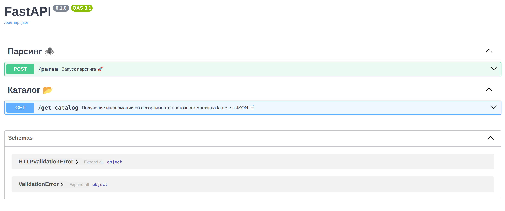

# 🏠 Home Work #5: Развертывание FastAPI-приложения и PostgreSQL в Docker

Этот **python - код** предназначен для парсинга сайта [La-Rose](https://la-rose.ru/) с целью получения актуальной информации об ассортименте букетов. Данные сохраняются в базу данных и предоставляются через API в формате JSON. Проект реализован с использованием **FastAPI** для создания API и **SQLAlchemy** для работы с базой данных. С возможностью развертывания в Docker-контейнерах.

---

## 🚀 Описание 
- Парсинг данных: Получение информации о букетах (название, изображение, цена, фиксированная цена, новинка) с сайта La-Rose.
- Сохранение в базу данных: Данные сохраняются в PostgreSQL, развернутой в отдельном Docker-контейнере.
- API для доступа к данным: Получение данных в формате JSON через FastAPI-приложение в отдельном контейнере.
- Гибкость: Код поддерживает работу с различными базами данных благодаря использованию SQLAlchemy.
- Docker-развертывание: Приложение и БД развернуты в отдельных контейнерах с настроенной сетью между ними.

---
## 🛠 Стек
- **Selenium**
- **FastAPI**
- **SQLAlchemy ORM**
- **Docker**
---

### 🗂 Документация данных

Структура данных, используемая для представления информации о букетах содержит следующие поля:

| Название поля       | Описание                                                                                                                   |
|---------------------|----------------------------------------------------------------------------------------------------------------------------|
| `title`             | Название букета. Уникальное имя, идентифицирующее конкретный букет.                                                        |
| `image_url`         | Ссылка на изображение букета. Используется для визуального отображения.                                                    |
| `fix_price`         | Фиксированная цена. Возможные значения: `yes` или `no`. Указывает, является ли цена фиксированной или может варьироваться. |
| `price`             | Цена букета. Числовое значение, представляющее текущую стоимость.                                                          |
| `new_release`       | Новинка. Возможные значения: `НОВИНКА` или `no`. Указывает, является ли букет новинкой.                                    |

### Пример данных

Ниже приведён пример записи данных о букете:

| title           | image_url                          | fix_price | price | new_release |
|-----------------|-------------------------------------|-----------|-------|-------------|
| Весенний букет  | http://example.com/spring_bouquet  | yes       | 1500  | yes         |
| Летний букет    | http://example.com/summer_bouquet  | no        | 1800  | no          |

## 🐳 Docker-развертывание

Проект использует два Docker-контейнера, связанных через внутреннюю сеть:

1. **FastAPI-приложение** (порт 8000)
   - Доступно по адресу: `http://localhost:8000`
   - Документация API: `http://localhost:8000/docs`
   - Использует образ: `fastapi_parser`
   - Проброшен порт: 8000:8000


2. **PostgreSQL** (порт 5432)
   - Версия: PostgreSQL 13
   - Данные сохраняются в volume: `postgres-data`
   - Доступные параметры подключения:
     - Хост БД в сети контейнеров: `postgres_db`
     - Внешний доступ: `localhost:5432`
     - Пользователь: `postgres`
     - Пароль: `12345`
     - Имя базы: `la-rose_db`

### Запуск проекта

1. Клонируйте репозиторий:
```
git clone -b FastAPI-Parser-Docker https://github.com/ilushka-obnimashka/Introduction-to-Computer-Networks
cd Introduction-to-Computer-Networks/hw3_4
```

2. Дайте права на выполнение скрипта:
```
chmod +x deploy.sh
```

3. Запустите развертывание:
```
./deploy.sh
```
Приложение будет доступно по адресу: http://localhost:8000

> [!Note]
> **Внимание:** 
> Для получения дальнейшей информации о работе веб приложения перейдите по адресу `http://localhost:8000/docs`



## 📄 API Endpoints

1. **Запуск парсинга** (стандартные параметры)
```bash
  curl -X POST "http://localhost:8000/parse"
```
2. **Получение информации** (стандартные параметры)
```bash
  curl -X GET "http://localhost:8000/get-catalog"
```
|или просто откройте браузер и перейдите по адресу 
